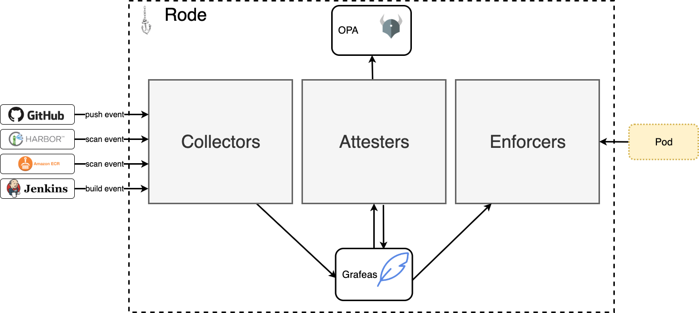
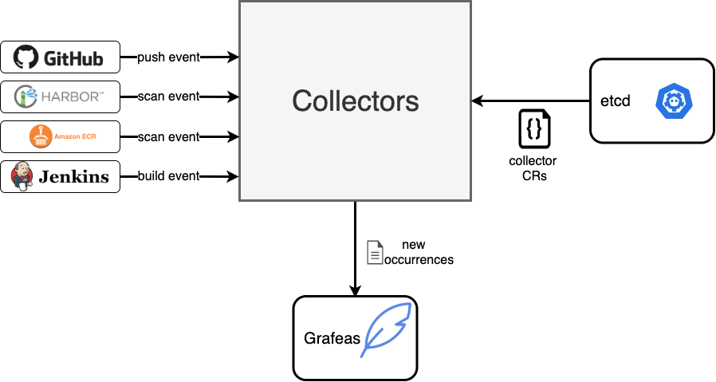
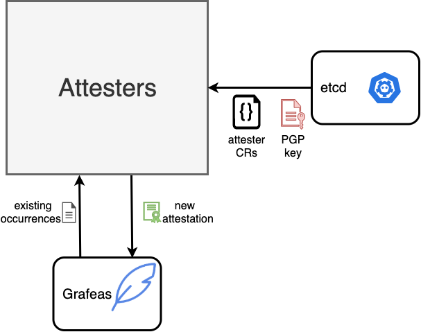
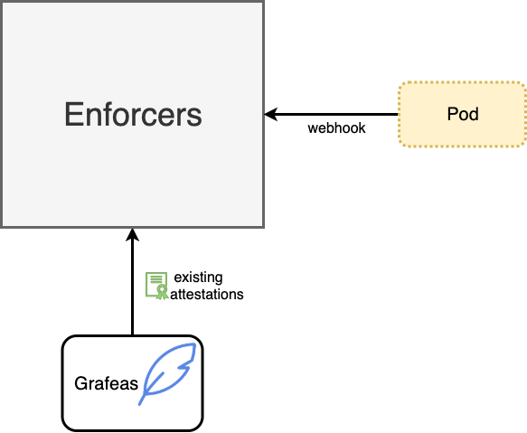

#  Rode 
> \rōd\ - a line (as of rope or chain) used to attach an anchor to a boat

Rode provides the collection, attestation and enforcement of policies in your software supply chain.



## Collectors
TODO



## Attesters
TODO



## Enforcers
TODO



# Installation
The ECR event collector requires the following IAM policy:

```
{
    "Version": "2012-10-17",
    "Statement": [
        {
            "Effect": "Allow",
            "Action": [
                "sqs:CreateQueue"
                "sqs:SetQueueAttributes",
                "sqs:GetQueueUrl",
                "sqs:GetQueueAttributes",
                "sqs:ReceiveMessage",
                "sqs:DeleteMessage",
            ],
            "Resource": "*"
        },
        {
            "Effect": "Allow",
            "Action": [
                "events:PutTargets",
                "events:PutRule"
            ],
            "Resource": "*"
        }
    ]
}
```
# Development
To run locally, use skaffold with the `local` profile:

`skaffold dev --port-forward`

This will also run [localstack](https://github.com/localstack/localstack) to mock services such as SQS.

To create an occurence, use the aws cli to send a test message to localstack:

```
aws sqs send-message \
    --endpoint-url http://localhost:30576 \
    --queue-url http://localhost:30576/queue/rode-ecr-event-collector  \
    --message-body file://test/sample_scan_event.json 
``` 
